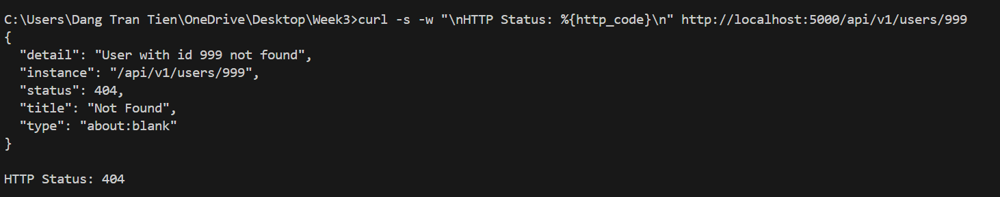
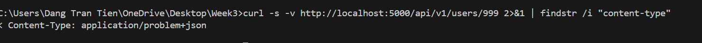
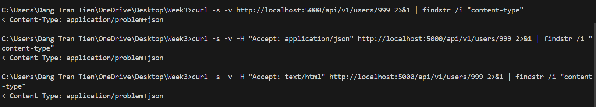
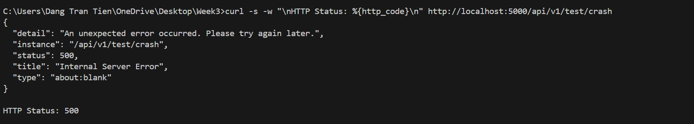

# Lab 2: Error Handler trả về problem+json

## Kiểm thử

### Test 1: Request resource không tồn tại → 404

### Test 2: Content-Type trả về là application/problem+json

### Test 3: Luôn trả problem+json bất kể Accept header

### Test 4: Unhandled exception → 500, không lộ stack trace

