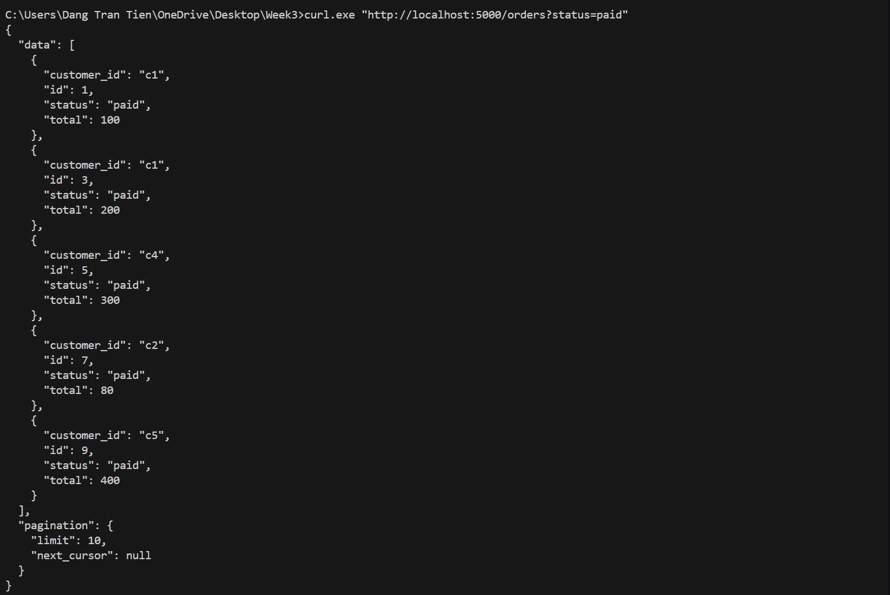
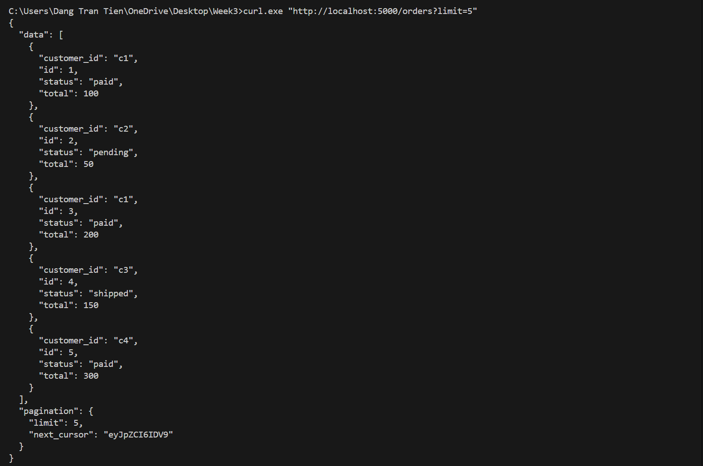
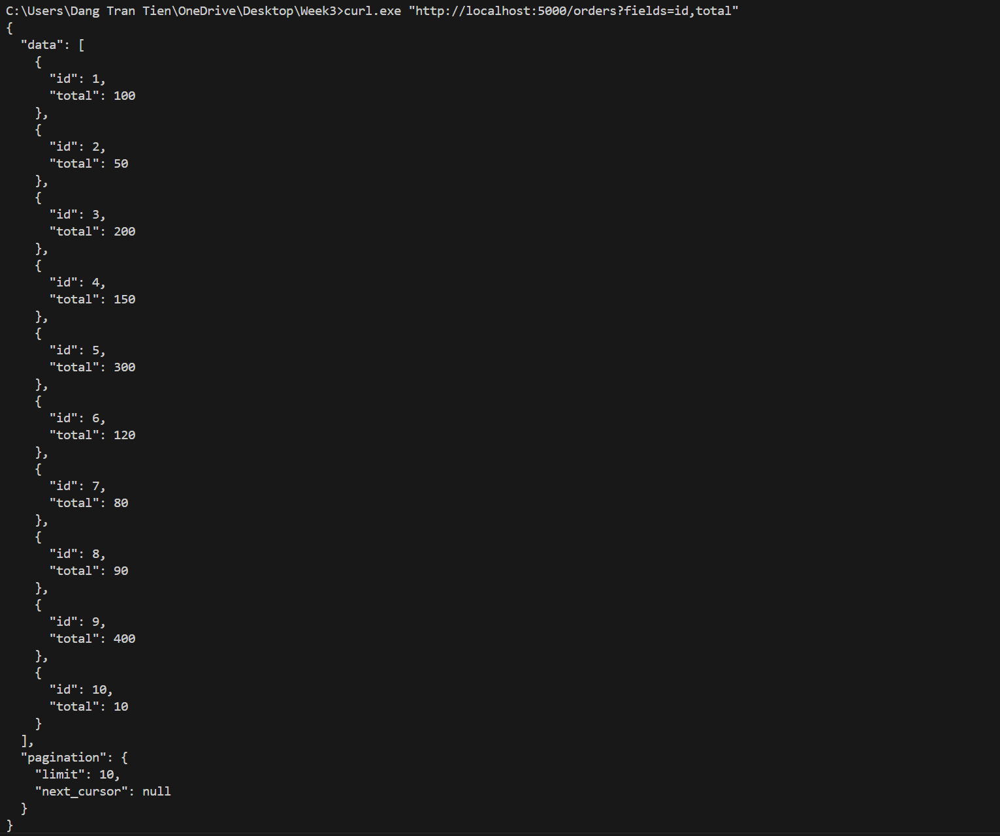
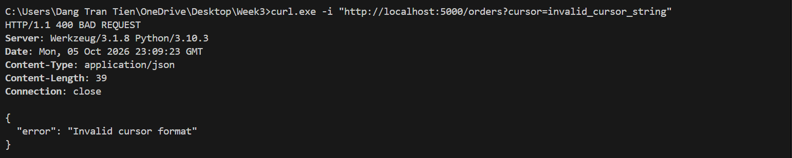

# Lab 3: Triển khai /orders có cursor pagination

## Kiểm thử

### Test 1: Lọc theo status (`status=paid`)

### Test 2: Phân trang Cursor pagination (`limit=5`)

### Test 3: Sparse fieldsets (`fields=id,total`)

### Test 4: Cursor không hợp lệ → 400 Bad Request

