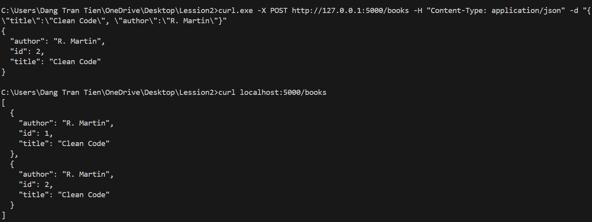
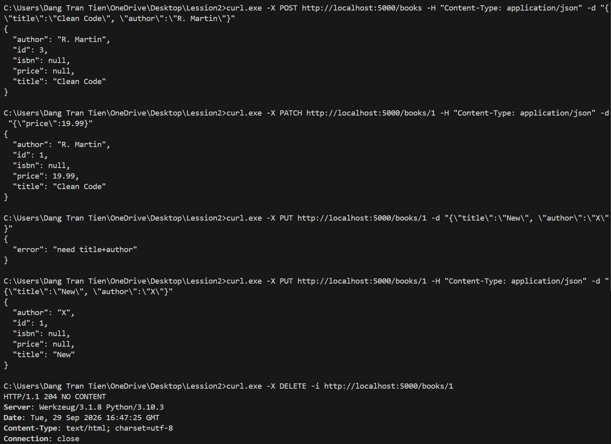
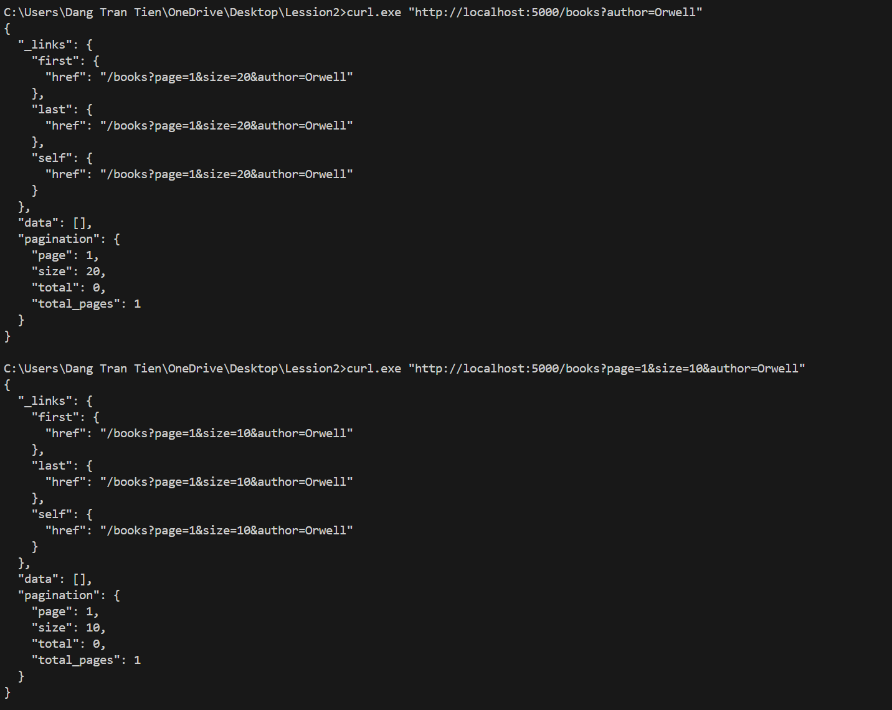
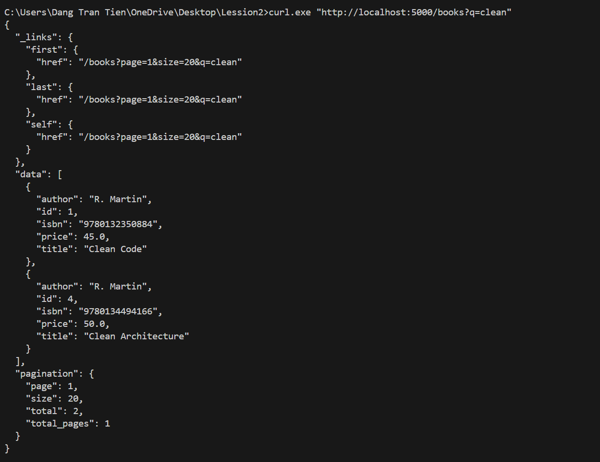
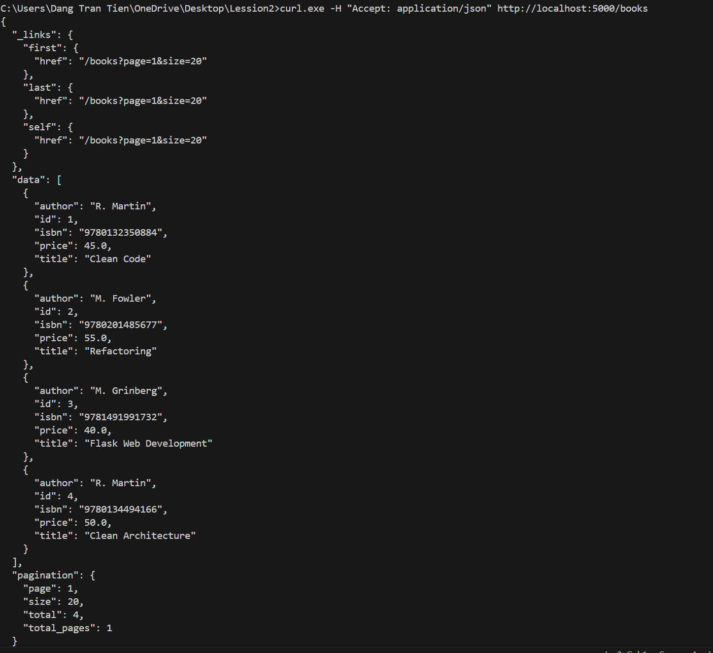
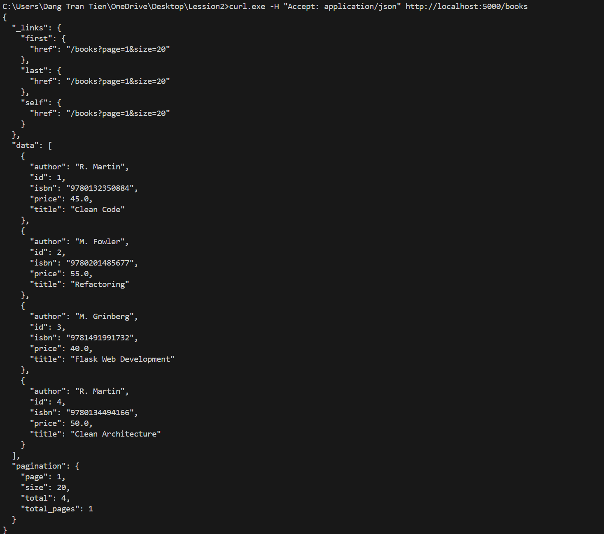

# API Session 02: RESTful API với Flask (Books Resource)

## Kiểm thử

### Bài 1: Tạo mới và lấy danh sách sách cơ bản (POST & GET /books)

### Bài 2: Cập nhật và xóa sách (POST, PATCH, PUT, DELETE /books)

### Bài 3.1: Phân trang kết hợp lọc theo tác giả (`author`)

### Bài 3.2.1: Tìm kiếm sách theo từ khóa (`q`)

### Bài 3.2.2: Lấy danh sách sách kèm HATEOAS Links & Phân trang

### Bài 3.3: Kiểm thử lấy danh sách sách với Header `Accept: application/json`

